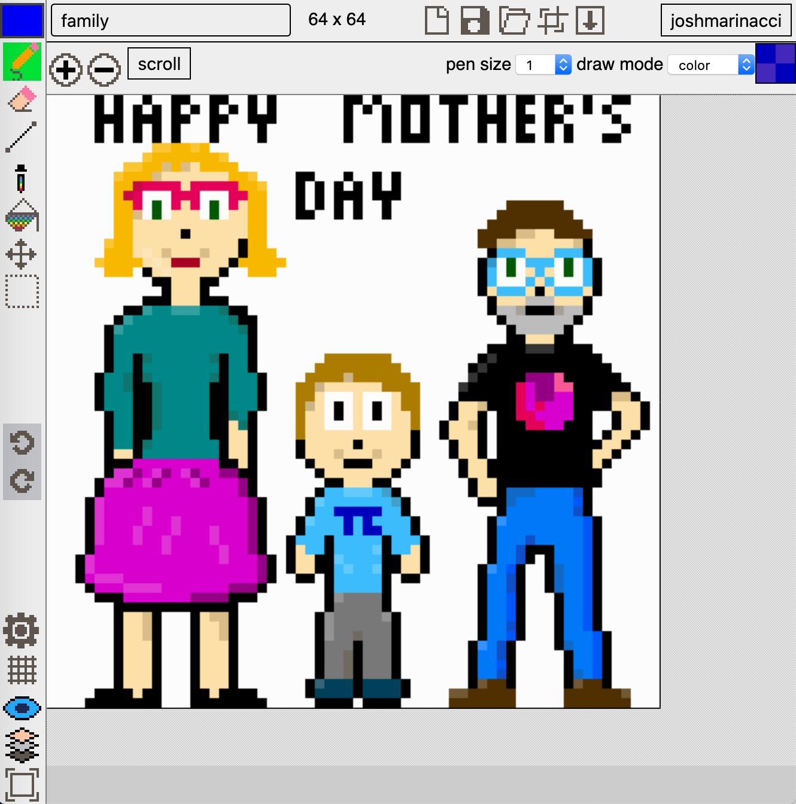

# pixel-eater

Eat All The Pixels with this open source web-based pixel 
art editor. Try it out at [https://apps.josh.earth/pixel-eater/](https://apps.josh.earth/pixel-eater/).

All drawing is done in the browser. The entire UI is in React with custom components.
The UI supports layers and different cursor
tools (eyedropper, pencil, eraser, move, fill, etc.)

Current Features & Tools

* pencil
* eraser
* lines, rectangles, ellipses
* eye dropper
* fill bucket
* move
* selection
* undo / redo
* define patterns

* choose either NES or Pico 8 palettes
* tracks your currently used colors
* layers
* preview panel
* full screen

* touch / mobile support

* export to PNG

There is a generic document server for saving and loading, though it currently is broken.

Contributions are super welcome. This is your editor as much as mine.

# Build Instructions

It's a standard [create-react-app](https://reactjs.org/docs/create-a-new-react-app.html) application. Build with `npm run build`. Open the editor with the file `dist/index.html` in your browser.

# future work

 
 
